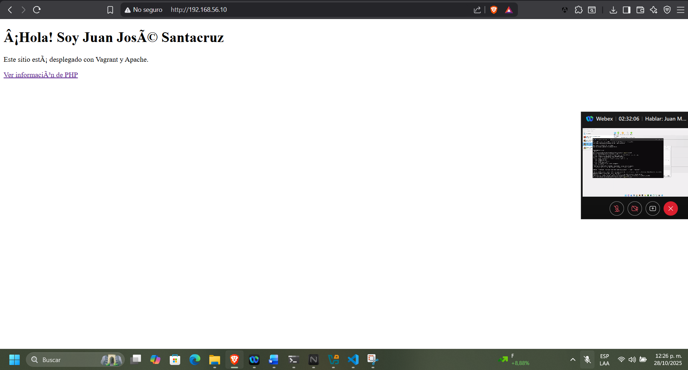

# README — Conexión PHP con PostgreSQL en Vagrant
## Juan Jose Santacruz Ferraro Las imagenes estan al final 
## Descripción del proyecto

Este proyecto configura dos máquinas virtuales con Vagrant para lograr la conexión entre un servidor web (PHP + Apache) y un servidor de base de datos (PostgreSQL).  
El objetivo fue que el archivo `conexion.php`, alojado en el servidor web, pudiera conectarse correctamente a la base de datos `reto_db` del servidor `db` usando la red interna entre ambas máquinas.
## Scripts de Provisionamiento

### provision-web.sh
Instala Apache y PHP, habilita el servicio y copia los archivos del proyecto al directorio `/var/www/html`.

### provision-db.sh
Instala PostgreSQL, configura el acceso remoto, crea la base de datos `reto_db`, el usuario `vagrant` y una tabla de ejemplo `empleados` con algunos datos de prueba.

## Configuración de las máquinas

### Máquina 1: db
IP: 192.168.56.11  
Rol: Servidor de base de datos PostgreSQL  

#### Instalación y configuración
```bash
sudo apt update
sudo apt install -y postgresql postgresql-contrib
```

Verificar el servicio:
```bash
sudo systemctl status postgresql
```

Habilitar la conexión desde otras máquinas:

1. Editar:
   ```bash
   sudo nano /etc/postgresql/12/main/postgresql.conf
   ```
   Cambiar:
   ```
   listen_addresses = 'localhost'
   ```
   por:
   ```
   listen_addresses = '*'
   ```

2. Editar:
   ```bash
   sudo nano /etc/postgresql/12/main/pg_hba.conf
   ```
   Agregar al final:
   ```
   host    all             all             192.168.56.0/24         md5
   ```

3. Reiniciar el servicio:
   ```bash
   sudo systemctl restart postgresql
   ```

#### Creación de base de datos y usuario
```bash
sudo -u postgres psql
```
Dentro de PostgreSQL:
```sql
CREATE DATABASE reto_db;
CREATE USER vagrant WITH PASSWORD 'vagrant';
GRANT ALL PRIVILEGES ON DATABASE reto_db TO vagrant;
\q
```

Verificar puerto 5432:
```bash
sudo ss -tulnp | grep 5432
```

### Máquina 2: web
IP: 192.168.56.10  
Rol: Servidor web con PHP y Apache  

#### Instalación
```bash
sudo apt update
sudo apt install -y apache2 php libapache2-mod-php php-pgsql postgresql-client
```

Verificar que Apache funcione:
```
http://192.168.56.10
```

## Conexión PHP → PostgreSQL

Archivo `/var/www/html/conexion.php`:

```php
<?php
$host = "192.168.56.11";
$port = "5432";
$dbname = "reto_db";
$user = "vagrant";
$password = "vagrant";

try {
    $conn = new PDO("pgsql:host=$host;port=$port;dbname=$dbname", $user, $password);
    $conn->setAttribute(PDO::ATTR_ERRMODE, PDO::ERRMODE_EXCEPTION);
    echo "Conexión exitosa a PostgreSQL ✅";
} catch (PDOException $e) {
    echo "Error de conexión: " . $e->getMessage();
}
?>
```

## Prueba de conexión

Ingresar desde el navegador:
```
http://192.168.56.10/conexion.php
```

Mensaje obtenido:
```
Conexión exitosa a PostgreSQL ✅
```

Error corregido:
```
permission denied for table empleados
```
Solución:
```sql
GRANT ALL PRIVILEGES ON ALL TABLES IN SCHEMA public TO vagrant;
GRANT ALL PRIVILEGES ON ALL SEQUENCES IN SCHEMA public TO vagrant;
```

## Resultado final

- Conexión establecida correctamente entre las máquinas web y db.  
- El archivo `conexion.php` funciona y se visualiza desde el navegador.  
- PostgreSQL configurado para aceptar conexiones desde la red interna 192.168.56.0/24.  
- PHP tiene habilitado el módulo php-pgsql.  
- Proyecto completamente funcional y probado.


